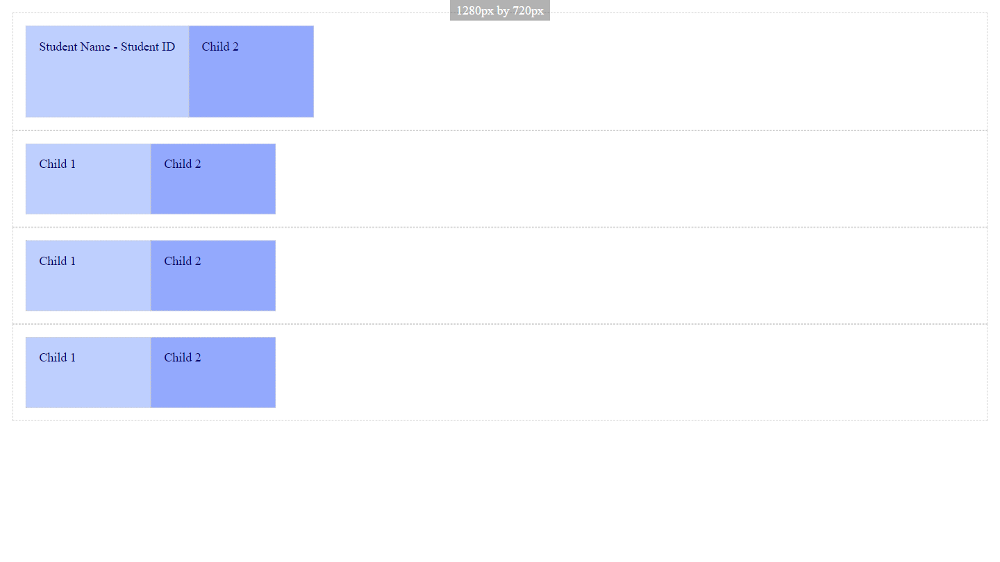

# display
This defines a flex container; inline or block depending on the given value. It enables a flex context for all its direct children.

However, to start testing these properties, we must set up basic styles for our parent and children elements.

```
.parent {
    border: 1px dashed #cccccc;
    padding: 1rem;
}

.child {
    border: 1px dotted #cccccc;
    padding: 1rem;
    aspect-ratio: 16/9;
    min-width: 10rem;
    width: 20rem;
    color: #02026b;
}

.child:nth-child(odd) { background-color: #becffe; }
.child:nth-child(even) { background-color: #93a9fd; }
```

Learn more about:
* [aspect-ratio](https://developer.mozilla.org/en-US/docs/Web/CSS/aspect-ratio)
* [nth-child](https://developer.mozilla.org/en-US/docs/Web/CSS/:nth-child)


After setting up these element styles, we can start testing our display property. 

## display: flex;

```
.parent {
    display: flex;
}
```



## display: inline-flex;

```
.parent {
    display: inline-flex;
}
```


This section came from: [CSS Tricks](https://css-tricks.com/snippets/css/a-guide-to-flexbox/)


<p class="codepen" data-height="300" data-default-tab="html,result" data-slug-hash="KKrOgvR" data-user="ccucalon" data-token="7fd835393c5184af664707e28e0aa2ff" style="height: 300px; box-sizing: border-box; display: flex; align-items: center; justify-content: center; border: 2px solid; margin: 1em 0; padding: 1em;">
  <span>See the Pen <a href="https://codepen.io/ccucalon/pen/KKrOgvR/7fd835393c5184af664707e28e0aa2ff">
  flexbox-display</a> by Carlos A Cucalon (<a href="https://codepen.io/ccucalon">@ccucalon</a>)
  on <a href="https://codepen.io">CodePen</a>.</span>
</p>
<script async src="https://cpwebassets.codepen.io/assets/embed/ei.js"></script>

- - -

[flex-direction](./../01%20-%20flex-direction/)